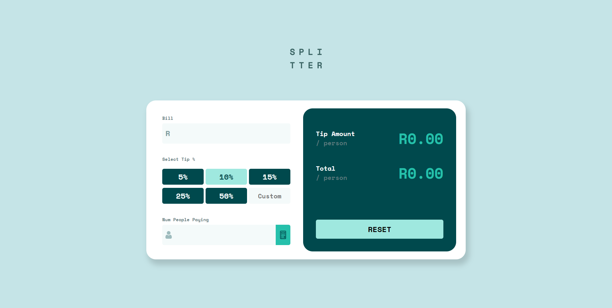
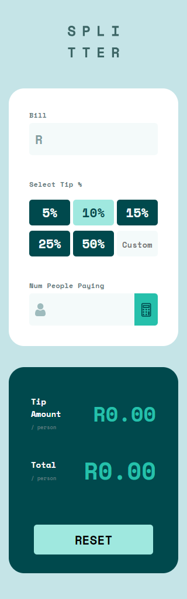

## Table of contents

- [Overview](#overview)
  - [The challenge](#the-challenge)
  - [Screenshot](#screenshot)
  - [Links](#links)
- [My process](#my-process)
  - [Built with](#built-with)
  - [What I learned](#what-i-learned)

## Overview

### The challenge

Users should be able to:

- View the optimal layout for the app depending on their device's screen size
- See hover states for all interactive elements on the page
- Calculate the correct tip and total cost of the bill per person

### Screenshot

#### Desktop



#### Mobile



### Links

- Solution URL: [Solution](https://github.com/NikeshCohen/Tip-Calculator)
- Live Site URL: [Add live site URL here](https://nc-tipcalculator.netlify.app/)

## My process

### Built with

- Semantic HTML5 markup
- CSS custom properties
- Flexbox
- Villina Javascript

### What I learned

Writing clean and easy to understand JavaScript. As well as having a greater understanding of the DOM.

```js
const findTip = () => {
  if (tipPercentageInput.value) {
    clearActiveClass();
    tipPercentage = tipPercentageInput.value;
  } else {
    tipPercentageBtnAll.forEach((btn) => {
      if (btn.classList.contains("active")) {
        tipPercentage = btn.value;
      }
    });
  }

  return tipPercentage;
};
```
